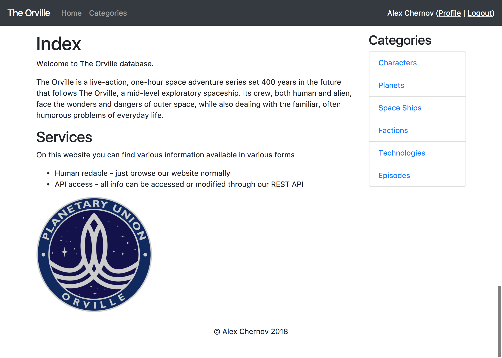

# Udactiy Catalog project
## The Orville database

Welcome to The Orville database project. It written in python3 using PostgreSQL database and flask framework.

Please make sure that you have all required packages installed:

- flask
- google-auth-httplib2
- google-api-python-client
- sqlalchemy

And you need python3 for sure and PostgreSQL installed, you can use Udacity virtual machine for Vagrant for it. 

First of all we need create `catalog` database.
```SQL
CREATE DATABASE "catalog"
```

After it we need populate database with data, please use `insert.py` for this.
```
python3 insert.py
```

At this moment we should be ready to launch project, it can run it two modes: debug and production.

For debug:
```
python3 index.py
```

For production:
```
python3 index.py --production
```


